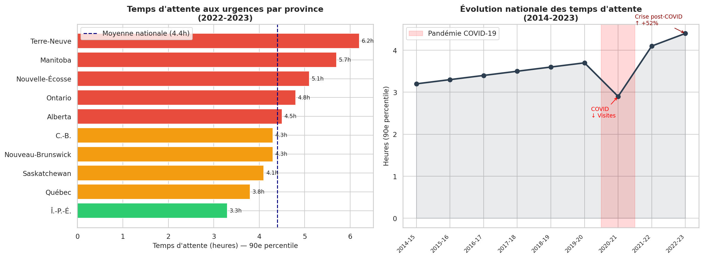
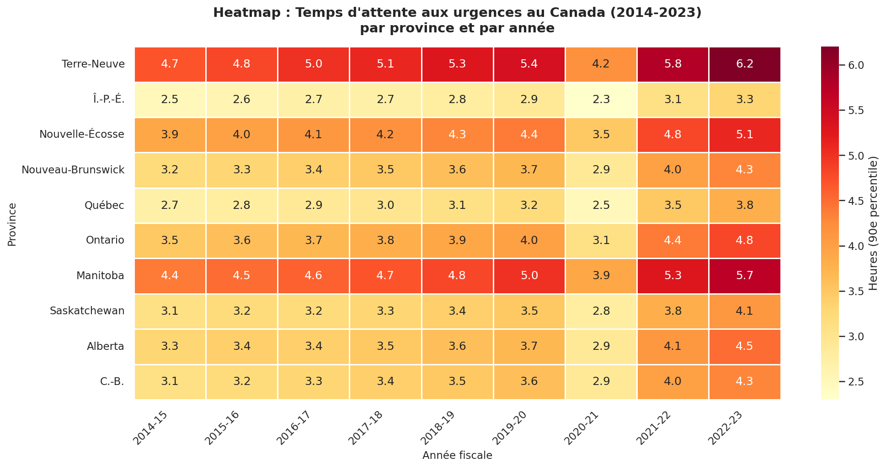

# 🏥 Canada Emergency Department Wait Times Analysis
### Analyse des temps d'attente aux urgences au Canada

[](https://python.org)
[](https://jupyter.org)
[](https://www.cihi.ca)
[](LICENSE)

---

## 📌 Overview

This project analyzes **emergency department (ED) wait times** across Canadian provinces over 9 fiscal years (2014–2023). Using publicly available data from the **Canadian Institute for Health Information (CIHI/ICIS)**, the analysis reveals the impact of COVID-19 on the healthcare system and identifies provinces facing the greatest challenges.

> **Impact for Canadians:** 1 in 5 Canadians visit an emergency department each year. Long wait times affect patient outcomes, healthcare worker burnout, and hospital efficiency.

---

## 📊 Key Findings

| Metric | Value |
|---|---|
| **Worst wait time (2022-23)** | Newfoundland (NL) — 6.2 hours (90th percentile) |
| **Best wait time (2022-23)** | PEI — 3.3 hours |
| **National average (2022-23)** | 4.4 hours |
| **Increase since 2014** | +37.5% nationally |
| **COVID-19 dip (2020-21)** | Dropped to 2.9h due to reduced visits |
| **Post-COVID rebound** | +52% in 2 years (2020-21 → 2022-23) |

---

## 📈 Visualizations

### Wait Times by Province (2022-23) + National Trend (2014-2023)


### Heatmap — All Provinces, All Years


---

## 🗂️ Project Structure

```
canada-er-wait-times/
├── analysis.ipynb              # Main Jupyter notebook
├── er_wait_times_analysis.png  # Bar chart + trend line
├── er_heatmap.png              # Province × Year heatmap
└── README.md
```

---

## 🔧 How to Run

```bash
# Clone the repository
git clone https://github.com/traoremohamedsamba22-ux/canada-er-wait-times.git
cd canada-er-wait-times

# Install dependencies
pip install pandas numpy matplotlib seaborn jupyter

# Run the notebook
jupyter notebook analysis.ipynb
```

---

## 📚 Data Source

- **Organization:** Canadian Institute for Health Information (CIHI / ICIS)
- **Indicator:** Physician Initial Assessment Wait Time — 90th percentile, in hours
- **Coverage:** 10 provinces + national average, fiscal years 2014-15 to 2022-23
- **Link:** [CIHI Emergency Department Wait Times](https://www.cihi.ca/en/indicators/emergency-department-wait-time-for-physician-initial-assessment)

---

## 💡 Insights & Applications

- **AI Triage Systems:** Recent studies suggest AI-powered triage tools could reduce wait times by 20–30% by optimizing patient flow
- **Resource Planning:** The post-COVID surge indicates urgent need for predictive staffing models
- **Policy Impact:** Atlantic provinces consistently outperform larger provinces — smaller hospital volume vs. service demand ratio is key

---

## 👤 Author

**Mohamed Samba Traoré**
Diplôme en Science des données appliquées & Intelligence Artificielle
Collège La Cité, Ottawa, Ontario
[LinkedIn](https://www.linkedin.com/in/traoremohamedsamba22) | [GitHub](https://github.com/traoremohamedsamba22-ux)

---

*Data is for educational and analytical purposes. All data is sourced from public Canadian government health statistics.*
